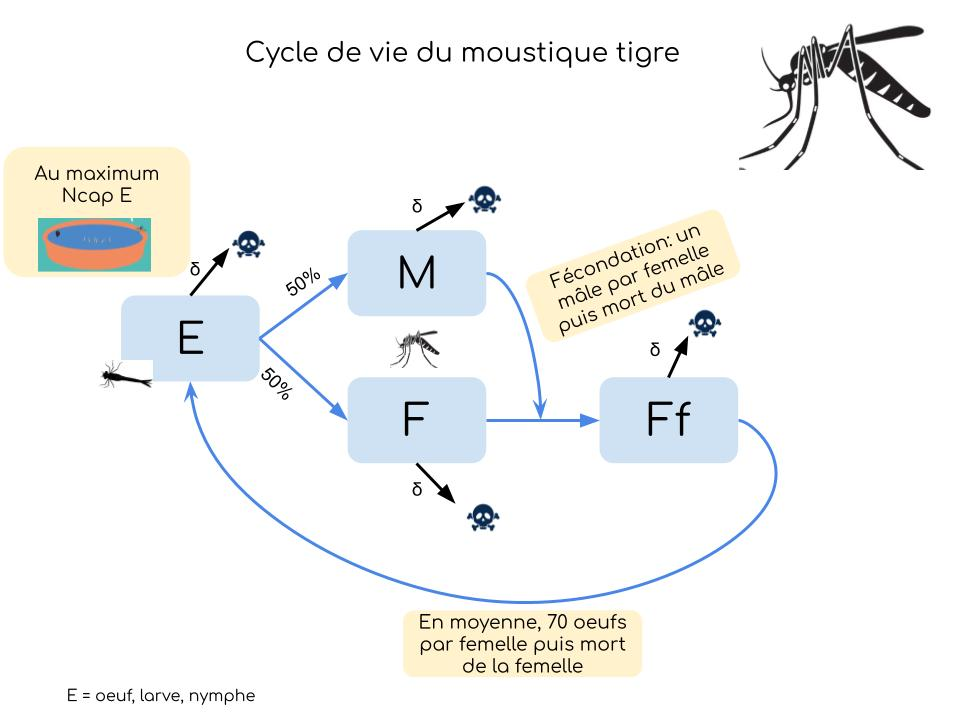

 
 </img>

Vous trouverez ici les ressources nécéssaires pour mener à bien le projet "Moustique Tigre" lors de la semaine des [Mouettes Savantes 2026](https://marieetienne.github.io/lesmouettessavantes/).  

### 0.  Contexte 
Vous avez toutes entendu parler du moustique tigre. A l'aide d'outils numériques et mathématique, nous allons nous pencher sur cette invasion, ses conséquences et  les solutions envisageable. 

### 1. Le moustique est-il dangereux? 

A l'aide de recherches sur internet et d'analyse de données, on se demandera pourquoi on craint tant le moustique tigre. 

**Données à disposition**: 

  - [Cas de dengue, zika et chikungunya](PreparedData/preparedData_cas_arbovirose_year.csv) (données issues de santé public france).  
  - [Présence du moustique sur le territoire métropolitain par département](PreparedData/preparedData_presenceMoustiqueTigre_departement_year.csv)  
  - [Progression du moustique sur le territoire métropolitain au cours du temps](PreparedData/preparedData_progressionMoustiqueTigre_year.csv)
  

### 2. Peut-on éradiquer le moustique? 

Dans cet [ article](https://www.inserm.fr/actualite/des-moustiques-genetiquement-modifies-pour-lutter-contre-la-propagation-des-maladies/), l'inserm propose des solutions pour contenir l'invasion. Nous allons utiliser un modèle mathématique et du code python pour comprendre comment évolue une population de moustiques tigre.   

 - Ecrire un programme Python permettant de "modéliser" une population de moustique tigre. On se basera sur le cycle de vie du moustique tigre simplifié:

 </img>

 - Modifier ce cycle de vie en fonction des 2 techniques proposées par l'INSERM 
 - Ecrire les programmes permettant de comparer l'évolution dans ces situations
 - Peut-on évaluer les couts financiers de chaque technique pour une même efficacité? 

*Last update on `r format(Sys.time(), '%d/%m/%y')` *

